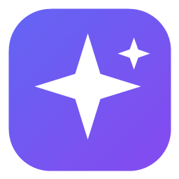
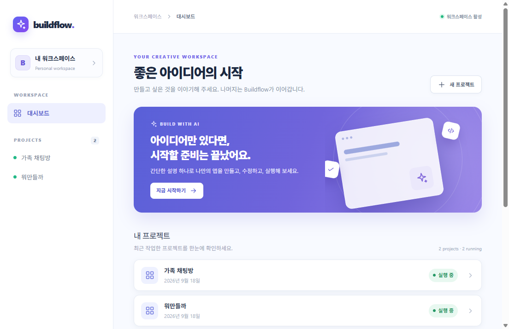

<div align="center">
  
  <h1>Buildflow</h1>
  <p><strong>원하는 앱을 설명하고, 바로 사용하고, 말로 수정하고, 안전하게 되돌리세요.</strong></p>
  <p>코드를 모르는 사람을 위한 로컬 우선 AI 앱 빌더입니다.</p>

  [다운로드](https://github.com/buildflow-labs/buildflow/releases/latest) · [기여하기](CONTRIBUTING.md) · [English](README.md)
</div>



## Buildflow가 다른 점

대부분의 AI 코딩 도구는 저장소, 터미널, 패키지 관리자, 빌드, 포트를 이해한다고 가정합니다. Buildflow에서는 네 가지만 하면 됩니다.

1. 만들고 싶은 프로그램을 설명합니다.
2. 생성된 프로그램을 사용합니다.
3. 바꾸고 싶은 내용을 자연어로 요청합니다.
4. 필요하면 이전 정상 버전으로 되돌립니다.

프로젝트와 사용자 데이터는 내 컴퓨터에 보관됩니다. Buildflow는 Codex CLI로 실제 Next.js 앱을 만들고, 타입 검사·테스트·빌드를 통과한 버전만 실행합니다.

## 현재 기능

- 자연어 요청으로 Next.js + TypeScript + SQLite 앱 생성
- 기존 앱 자연어 수정
- 격리된 작업 공간에서 변경 검증
- 정상 버전 자동 저장 및 원클릭 복원
- 저장 데이터 변경 전 사용자 승인
- 로컬 전용 실행 환경
- 일반 사용자용 진행 화면과 선택형 상세 로그
- 격리된 Electron 렌더러와 검증된 IPC

## 시작하기

최신 Windows 설치 파일은 [GitHub Releases](https://github.com/buildflow-labs/buildflow/releases/latest)에서 받을 수 있습니다.

Codex CLI를 설치하고 한 번 로그인하세요.

```powershell
npm install -g @openai/codex
codex login
```

소스에서 실행하려면 Node.js 24+와 Git 2.23+가 필요합니다.

```bash
git clone https://github.com/buildflow-labs/buildflow.git
cd buildflow
npm ci
npm run dev
```

## 프로젝트 상태

현재는 공개 초기 MVP입니다. 생성 → 수정 → 복원 전체 흐름이 실제로 동작하고 자동 테스트로 보호되지만, 1.0 이전에는 API와 프로젝트 형식이 바뀔 수 있습니다.

[기여 가이드](CONTRIBUTING.md), [로드맵](ROADMAP.md), [보안 정책](SECURITY.md)을 확인해 주세요.

## 라이선스

Apache License 2.0. 자세한 내용은 [LICENSE](LICENSE)를 확인하세요.

Buildflow는 독립 오픈소스 프로젝트이며 OpenAI의 공식 제품이 아닙니다.
