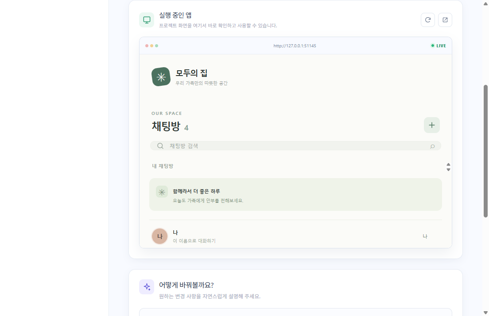
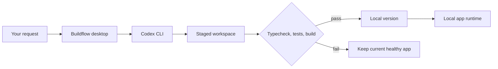

<div align="center">
  
  <h1>Buildflow</h1>
  <p><strong>Describe an app. Use it. Change it with words. Roll back safely.</strong></p>
  <p>A local-first AI app builder for people who do not write code.</p>

  [](https://github.com/buildflow-labs/buildflow/actions/workflows/ci.yml)
  [](https://github.com/buildflow-labs/buildflow/releases)
  [](LICENSE)
  [](https://github.com/buildflow-labs/buildflow/discussions)

  [Download](https://github.com/buildflow-labs/buildflow/releases/latest) · [Getting started](#getting-started) · [Contributing](CONTRIBUTING.md) · [한국어](README.ko.md)
</div>


## Why Buildflow?

Most AI coding tools assume you understand repositories, terminals, package managers, builds, and ports. Buildflow hides that machinery behind four actions:

1. Describe what you want.
2. Use the generated app.
3. Ask for changes in natural language.
4. Restore any earlier working version.

Your projects and user data stay on your machine. Buildflow uses the Codex CLI to create real Next.js applications, validates them, saves working versions with local Git, and runs them locally.

## What works today

- **Prompt to working app** — creates a Next.js + TypeScript + SQLite application.
- **Natural language changes** — edits an existing app in an isolated staging workspace.
- **Safe versions** — only validated builds become runnable versions.
- **One-click recovery** — validates and launches an earlier version while keeping version history.
- **Data protection** — asks before a requested change alters persisted user data.
- **Local runtime** — projects run on loopback only; no cloud backend or public tunnel.
- **Friendly progress** — technical output stays in an optional advanced log.
- **Secure Electron boundary** — sandboxed renderer, context isolation, typed and validated IPC.



## Getting started

### Download the desktop app

Download the latest Windows installer from [GitHub Releases](https://github.com/buildflow-labs/buildflow/releases/latest).

Buildflow currently ships a Windows installer. macOS and Linux packaging are on the [roadmap](ROADMAP.md).

### Prerequisites

Buildflow delegates code generation to the [OpenAI Codex CLI](https://github.com/openai/codex). Install and sign in once:

```powershell
npm install -g @openai/codex
codex login
```

You also need:

- Node.js 24+
- Git 2.23+

### Build from source

```bash
git clone https://github.com/buildflow-labs/buildflow.git
cd buildflow
npm ci
npm run dev
```

Quality checks:

```bash
npm run typecheck
npm test
npm run build
```

Create a Windows installer:

```bash
npm run package:win
```

## How it works



Generated apps are ordinary source projects in your local Buildflow data directory. The desktop app owns process lifecycle, validation, version history, and recovery. The coding agent cannot publish the app or start a persistent server.

See [Architecture](docs/ARCHITECTURE.md) for the trust boundaries and transaction flow.

## Project status

Buildflow is an early public MVP. The create → modify → recover vertical slice is working and covered by automated tests, but APIs and project formats may change before 1.0.

Good first contributions include accessibility, macOS/Linux packaging, onboarding, and richer recovery diagnostics. See the [roadmap](ROADMAP.md) and issues labeled [`good first issue`](https://github.com/buildflow-labs/buildflow/labels/good%20first%20issue).

## Principles

- The user should never need Git, npm, or terminal knowledge.
- A failed change must not replace the last healthy app.
- User data stays local and destructive changes require consent.
- Generated apps are real, inspectable applications rather than hosted demos.
- The control plane stays small enough to understand and audit.

## Contributing

Read [CONTRIBUTING.md](CONTRIBUTING.md) for the local setup, test gates, and pull request process. Please follow our [Code of Conduct](CODE_OF_CONDUCT.md). Security reports belong in the private process described by [SECURITY.md](SECURITY.md).

## License

Apache License 2.0. See [LICENSE](LICENSE).

Buildflow is an independent open-source project and is not affiliated with or endorsed by OpenAI.
